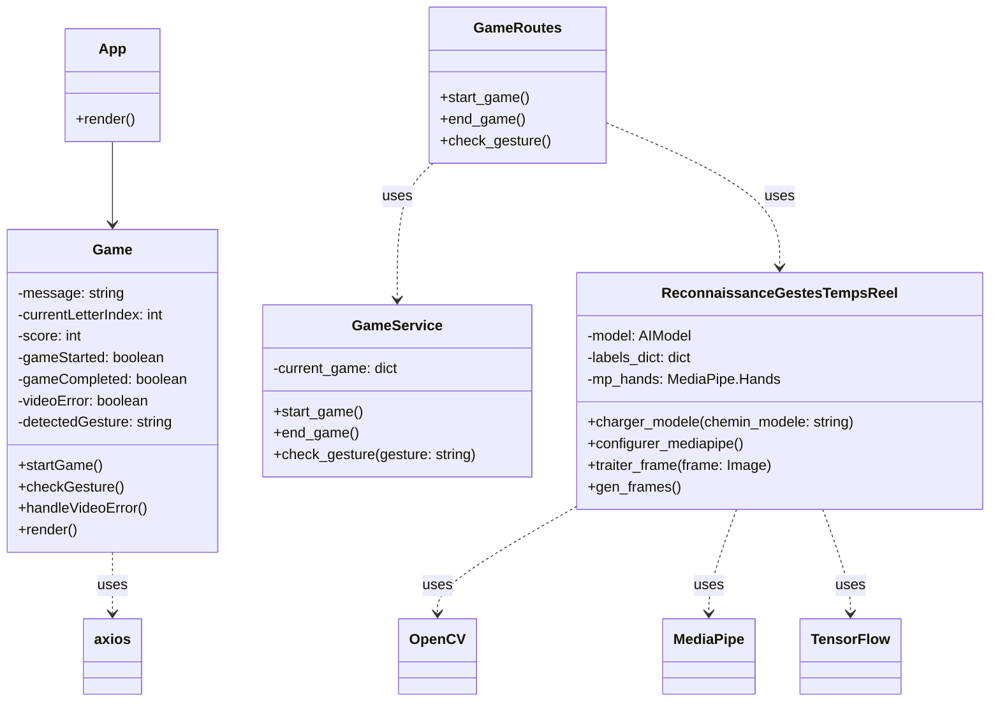

# Présentation Technique du Projet HandPi Games

## 1. Vue d'ensemble du projet

HandPi Games est une application innovante qui utilise la reconnaissance de gestes par IA pour créer des jeux éducatifs interactifs. Notre première itération, le jeu ABCD, permet aux utilisateurs d'apprendre l'alphabet en effectuant des gestes correspondant aux lettres A, B, C et D.

## 2. Architecture globale

L'application suit une architecture client-serveur classique :

- **Frontend** : Application React
- **Backend** : Serveur Flask (Python)
- **Matériel** : Raspberry Pi 4 avec module caméra

### Flux de données

1. Le frontend demande une vérification de geste au backend via l'API
2. Le backend capture une image via la caméra côté serveur
3. Le backend traite l'image et reconnaît le geste
4. Le résultat de la reconnaissance est renvoyé au frontend pour mise à jour de l'interface
5. Le frontend affiche le flux vidéo en continu via une balise `` pointant vers l'endpoint `/video_feed`

Cette approche présente plusieurs avantages :

- Réduction de la charge sur le client (pas de traitement d'image côté frontend)
- Meilleure sécurité (le modèle de reconnaissance reste côté serveur)
- Compatibilité accrue (fonctionne sur des clients avec des capacités variées)

Il est important de noter que pour une adaptation mobile future, cette logique pourrait nécessiter des ajustements, notamment pour la capture et l'envoi d'images depuis l'appareil mobile vers le serveur.

## 3. Composants clés

### 3.1 Frontend (React)

#### Fichiers principaux :

- `src/App.jsx` : Point d'entrée de l'application
- `src/components/game/Game.jsx` : Logique principale du jeu

#### Fonctionnalités clés :

- Utilisation de hooks React (`useState`, `useEffect`) pour la gestion d'état
- Communication avec le backend via Axios
- Rendu conditionnel basé sur l'état du jeu

#### Exemple de code (Game.jsx) :

```jsx
const [gameStarted, setGameStarted] = useState(false);
const [currentLetterIndex, setCurrentLetterIndex] = useState(0);

useEffect(() => {
  if (gameStarted) {
    const interval = setInterval(checkGesture, 1000);
    return () => clearInterval(interval);
  }
}, [gameStarted, currentLetterIndex]);
```

Ce code utilise `useState` pour gérer l'état du jeu et `useEffect` pour configurer un intervalle qui vérifie les gestes toutes les secondes.

### 3.2 Backend (Flask)

#### Fichiers principaux :

- `run.py` : Point d'entrée du serveur
- `app/routes/game_routes.py` : Routes API pour le jeu
- `app/services/game_service.py` : Logique du jeu
- `app/models/reconnaissance_gestes_temps_reel.py` : Traitement des gestes

#### Fonctionnalités clés :

- API RESTful avec Flask
- Traitement d'image avec OpenCV
- Reconnaissance de gestes avec TensorFlow/Keras

#### Exemple de code (game_routes.py) :

```python
@bp.route('/check', methods=['GET'])
def check_gesture():
    reconnaissance_gestes = get_reconnaissance_gestes()
    cap = cv2.VideoCapture(0)
    ret, frame = cap.read()
    cap.release()

    if not ret or frame is None:
        return jsonify({'message': 'No frame available'}), 400

    result = reconnaissance_gestes.traiter_frame(frame)
    predicted_gesture = result.get('predicted_character', 'Unknown')
    game_result = game_service.check_gesture(predicted_gesture)
    return jsonify({**game_result, 'predicted_gesture': predicted_gesture})
```

Cette route capture une image, la traite pour reconnaître un geste, puis vérifie si le geste correspond à la lettre attendue.

## 3.3 Diagramme de Classes

Pour mieux comprendre la structure de notre projet, voici un diagramme de classes représentant les principaux composants et leurs relations :



### Explication du Diagramme de Classes

1. **App** : C'est le composant React principal qui sert de point d'entrée à notre application frontend. Il est responsable du rendu global de l'interface utilisateur.

2. **Game** : Cette classe représente le composant React qui gère la logique et l'interface utilisateur du jeu. Elle maintient l'état du jeu (score, lettre actuelle, etc.) et contient des méthodes pour démarrer le jeu, vérifier les gestes et gérer les erreurs vidéo.

3. **GameService** : C'est un service backend qui gère l'état du jeu côté serveur. Il contient des méthodes pour démarrer et terminer une partie, ainsi que pour vérifier si un geste correspond à la lettre attendue.

4. **ReconnaissanceGestesTempsReel** : Cette classe est au cœur de notre système de reconnaissance de gestes. Elle utilise un modèle d'IA (probablement TensorFlow) pour analyser les images et prédire les gestes. Elle s'appuie sur OpenCV pour le traitement d'image et MediaPipe pour la détection des mains.

5. **GameRoutes** : Cette classe représente les routes Flask de notre API backend. Elle fait le lien entre les requêtes HTTP entrantes et les services appropriés (GameService et ReconnaissanceGestesTempsReel).

### Relations entre les Classes

- Le composant **App** contient le composant **Game**.
- **Game** utilise la bibliothèque axios pour communiquer avec le backend via les routes définies dans **GameRoutes**.
- **GameRoutes** utilise **GameService** pour gérer la logique du jeu et **ReconnaissanceGestesTempsReel** pour la reconnaissance des gestes.
- **ReconnaissanceGestesTempsReel** dépend d'OpenCV, MediaPipe et TensorFlow pour ses fonctionnalités.

Ce diagramme de classes nous donne une vue d'ensemble de l'architecture de notre application, montrant comment les différents composants interagissent entre eux. Il met en évidence la séparation claire entre le frontend (React) et le backend (Flask), ainsi que l'utilisation de services spécialisés pour la gestion du jeu et la reconnaissance des gestes.

Cette structure modulaire facilite la maintenance et l'évolution future du projet, permettant par exemple d'ajouter de nouveaux jeux ou d'améliorer l'algorithme de reconnaissance des gestes sans impacter l'ensemble du système.

## 4. Patterns de conception et principes

### 4.1 Singleton

Utilisé pour `GameService` et `ReconnaissanceGestesTempsReel` pour garantir une seule instance.

### 4.2 Factory

La fonction `get_reconnaissance_gestes()` agit comme une factory pour créer l'instance de `ReconnaissanceGestesTempsReel`.

### 4.3 Dependency Injection

Les services sont injectés dans les routes, permettant une meilleure testabilité et modularité.

### 4.4 RESTful API

L'API suit les principes REST pour une interface cohérente et scalable.

## 5. Flux de jeu détaillé

1. L'utilisateur démarre le jeu via l'interface React
2. Le frontend envoie une requête POST à `/api/game/start`
3. Le backend initialise une nouvelle partie
4. Toutes les secondes, le frontend envoie une requête GET à `/api/game/check`
5. Le backend capture une image, reconnaît le geste, et vérifie s'il correspond à la lettre actuelle
6. Le frontend met à jour l'interface en fonction de la réponse

## 6. Traitement d'image et IA

1. Capture d'image avec OpenCV
2. Prétraitement de l'image (flip, conversion en RGB)
3. Détection des points de repère de la main avec MediaPipe
4. Extraction des caractéristiques (42 points normalisés)
5. Prédiction du geste avec un modèle TensorFlow/Keras pré-entraîné

## 7. Défis techniques et solutions

- **Problème** : Latence dans la reconnaissance des gestes
  **Solution** : Optimisation du traitement d'image et du modèle IA

- **Problème** : Gestion de l'état du jeu entre le frontend et le backend
  **Solution** : Utilisation d'un service côté serveur pour maintenir l'état du jeu

## 8. Perspectives d'évolution

- Ajout de nouvelles lettres et gestes
- Implémentation de jeux plus complexes
- Développement d'une version mobile
- Amélioration des performances de reconnaissance des gestes

Cette présentation couvre les aspects techniques clés de notre projet HandPi Games, démontrant notre compréhension approfondie de l'architecture, des technologies utilisées, et des principes de conception appliqués.
