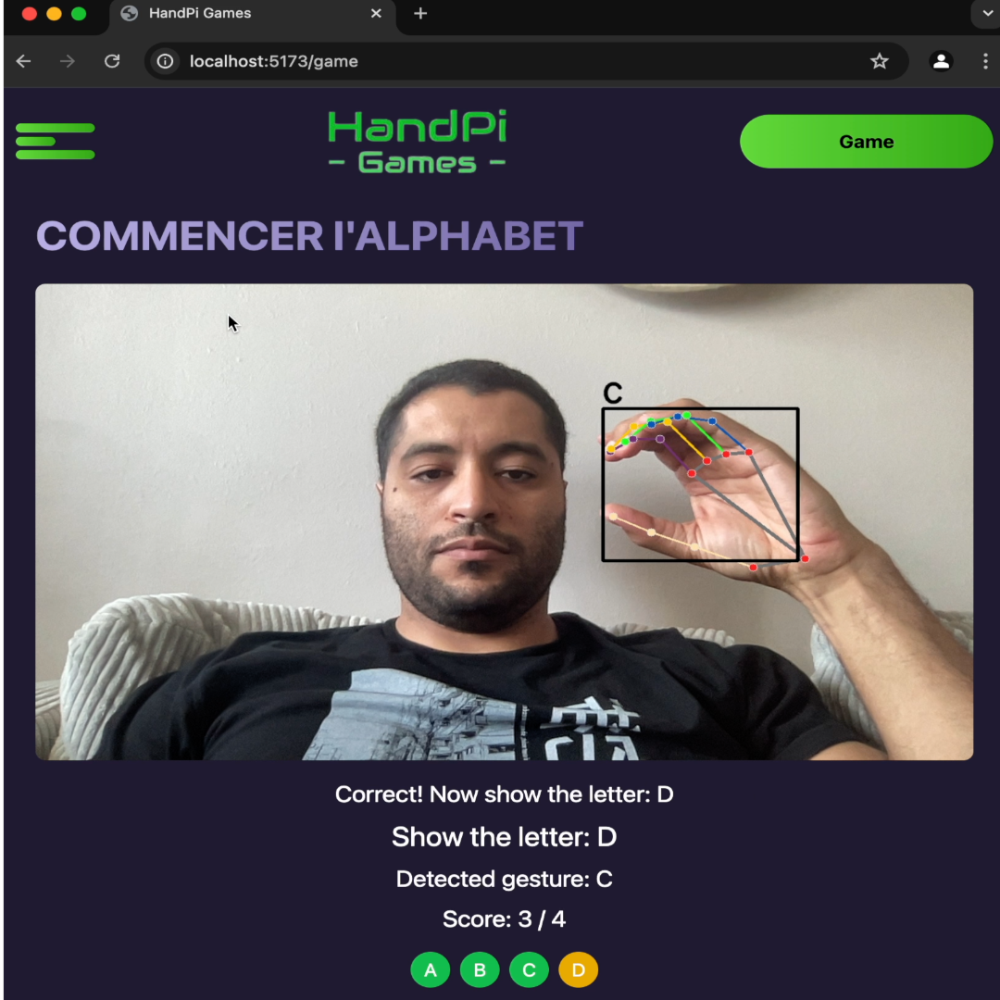

# HandPi Games

An innovative AI-powered hand gesture recognition game developed for the "Open Project IoT" hackathon.



## Project Overview

HandPi Games integrates IoT, AI, and interactive learning through a Raspberry Pi-based system that recognizes hand gestures to play educational games.

### Current Status: ABCD Game (Test Version)

- Players show hand gestures for letters A, B, C, and D
- Real-time AI recognition of gestures
- Score tracking and game completion logic

## Tech Stack

- **Hardware**: Raspberry Pi 4, Camera Module
- **Backend**: Python, Flask, OpenCV, TensorFlow/Keras
- **Frontend**: React, HTML/CSS/JavaScript

## Project Flow

The following sequence diagram illustrates the flow of the ABCD game, from start to finish:


This diagram shows the interaction between the player, frontend, backend, and various components during a game session.

## Quick Start Guide

### Prerequisites

- Python 3.8+
- Node.js 14+
- npm 6+

### Backend Setup

1. Navigate to the backend directory:
   ```
   cd backend
   ```
2. Create and activate a virtual environment:
   ```
   python -m venv venv
   source venv/bin/activate  # On Windows use `venv\Scripts\activate`
   ```
3. Install dependencies:
   ```
   pip install -r requirements.txt
   ```
4. Start the Flask server:
   ```
   python run.py
   ```

### Frontend Setup

1. Navigate to the frontend directory:
   ```
   cd frontend
   ```
2. Install dependencies:
   ```
   npm install
   ```
3. Start the React development server:
   ```
   npm start
   ```

### Playing the Test Game

1. Ensure both backend and frontend servers are running.
2. Open a web browser and go to `http://localhost:5173/`.
3. Click "Start Game" and follow on-screen instructions to show hand gestures for letters A, B, C, and D.
4. The game will recognize your gestures and progress through the alphabet.

## Project Structure

- `backend/`: Flask server, AI model, and game logic
- `frontend/`: React application and user interface
- `model/`: Gesture recognition model and training scripts

## Future Plans

- Expand gesture recognition to full alphabet and words
- Implement multiplayer functionality
- Enhance UI/UX based on user feedback

## Acknowledgments

- "Open Project IoT" hackathon organizers
- All team members and contributors

For more details, please refer to our [documentation](Docs/presentation-technique-fr.md).
